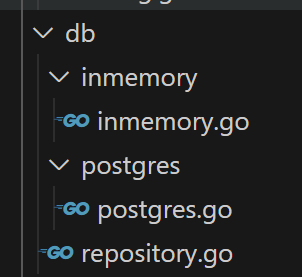

# Repository Pattern

What you may have noticed in our little tour is that we have to explicitly change the code when we want to call a different database. This is a bit of a shame really, as it means we are *tightly-coupled* to our database.

We can't easily change out our database for another one without updating a load of code. Sad times indeed.

Wouldn't it be good if we could change minimal code, maybe a line in a config file, and then it would automatically switch from in-memory to postgres, or mysql?

Fortunately larger brains than mine have thought about this and have come up with the *repository pattern*.

The repository pattern is a design pattern commonly used in software development, particularly in applications that interact with a data storage system such as a database. It provides an *abstraction layer* between the application's business logic and the data access code, encapsulating the logic required to access and manipulate data.

It does this by using an *interface*. First, you define an interface that represents the contract for data access operations. This interface typically includes methods for common CRUD (Create, Read, Update, Delete) operations and any other data access methods required.

Then you create *concrete* implementations of the repository *interface* for specific data storage systems. Each implementation contains the logic to interact with the corresponding data storage system.

You can now use the interface definition directly, by utilising *dependency injection*. That is, rather than the service layer being in charge of what dat layer it is using, we *tell* it which one to use, or *inject* it, normally via a constructor.

This is amazing news for us, as we don't have to touch the business logic or api layer at all to make this change.

## The Config

We're going to want to switch between configurations. I'm going to do this in code rather than reading from an actual config file for now.

```go
package config

type DatabaseConfig struct {
	Type     string // e.g., "postgres", "inmemory"
	Host     string
	User     string
	Password string
	SSLMode  string
	DBName   string
}

var InMemory DatabaseConfig = DatabaseConfig{Type: "inmemory", Host: "N/A", User: "", Password: ""}

var Postgres DatabaseConfig = DatabaseConfig{Type: "postgres", DBName: "acme", Host: "localhost", User: "postgres", Password: "yourpassword", SSLMode: "disable"}
```

The package config has a struct `DatabaseConfig`, which contains our properties. Then we have two public variables with an instance of `databaseConfig` - one for InMemory and one for Postgres - which contain the connection info.

Now, in our `main.go` file we can "load" a config:

```go
func main() {
    // Load configuration
    config := config.InMemory

    //...
}
```

## The Interface

We need a contract - an *interface* - for all concrete implementations to adhere to. The interface has functions it says every concrete implementation will have. We've named the struct `Repository` so it's easier to see what it is.

```go
package db

import (
	"acme/model"
)

type Repository interface {
    GetUsers() ([]model.User, error)
    GetUser(id int) (model.User, error)
    AddUser(user model.User) (id int, err error)
    UpdateUser(id int, user *model.User) (model.User, error)
    DeleteUser(id int) error
	Close()
}

```

> In Go, interfaces are a way to define a set of methods that a type *must* implement, without specifying how these methods are implemented. Think of an interface as a contract: if a type says it implements an interface, it promises to provide implementations for the methods listed in that interface.
>
>Defining an interface in Go is straightforward. You simply list the method signatures that the interface requires. Unlike some other languages, Go interfaces are implicit. This means you don’t have to explicitly declare that a type implements an interface. Instead, if a type provides the necessary methods, it automatically satisfies the interface.
>
>For instance, imagine you have an interface `Reader` with a method `Read`. Any type that has a `Read` method with the same signature automatically implements the `Reader` interface. This allows for very flexible and decoupled code. You can create functions that accept interfaces, and any type that fulfills the interface can be passed into those functions.
>
>This implicit implementation can sometimes feel like magic because you don’t need to write any extra code to declare that a type satisfies an interface. It just needs to have the right methods. 

[Interfaces in Go](https://www.alexedwards.net/blog/interfaces-explained)

## Implementing the interface

We need to update our `inmemory.go` and `postgres.go` files to implement the interface, but before that let's restructure our project so both our in-memory and postgres code is in the `db` folder:



Now our interface defines methods that each struct must implement to conform to it. At the moment our in-memory and postgres instances use functions rather than methods.

### inmemory.go

Let's start with our `inmemory.go` file, and add a new struct called `InMemoryRepository`:

```go
package inmemory

import (
	"acme/model"
	"errors"
	"slices"
)

type InMemoryRepository struct{}
```

Now we will remove our `init` function and replace it with a constructor, `NewInMemoryRepository`:

```go
var count int = 3
var users []model.User

func NewInMemoryRepository() *InMemoryRepository {
    InitDB() // Initialize the in-memory database with sample data
    return &InMemoryRepository{}
}

func InitDB() {
	users = []model.User{
		{ID: 1, Name: "User 1"},
		{ID: 2, Name: "User 2"},
		{ID: 3, Name: "User 3"},
	}
}
```

> :exclamation: In Go, constructors are a bit different from other languages, in that it is a separate method that returns a pointer to itself.
>
> The convention is to name these functions NewTypeName, where TypeName is the name of the type you're creating.
>
> Think of a constructor as a helper function that sets up your new object. It initializes any fields, performs any setup tasks, and then returns the fully constructed object. This approach ensures that your objects are always created in a valid state.
> 
> As an example if you have a Person struct with fields like Name and Age, you might write a NewPerson function that takes in a name and age, sets up the Person struct with those values, and returns it. This makes it clear and easy to see how a Person is constructed, and it also allows you to enforce any rules or defaults in one place.
>
>The advantage of using constructors is that they encapsulate the initialization logic, so you don't have to repeat it every time you create a new instance of your type. This leads to cleaner, more maintainable code.

Now we need to update all of our functions to be methods by adding `(repo *InMemoryRepository)` after `func`:

**Old**
```go
func GetUsers() ([]model.User, error) {
	return users, nil
}
```

**New**
```go
func (repo *InMemoryRepository) GetUsers() ([]model.User, error) {
	return users, nil
}
```

Do this for all the remaining functions needed to satisfy the interface:

```go
func (repo *InMemoryRepository) AddUser(user model.User) (id int, err error) {
	count++
	user.ID = count

	users = append(users, user)

	return count, nil
}

func (repo *InMemoryRepository) GetUser(id int) (model.User, error) {
	var user model.User

	for _, user := range users {
		if user.ID == id {
			return user, nil
		}
	}

	return user, errors.New("User id not found.")

}

func (repo *InMemoryRepository) DeleteUser(id int) error {

	for index, user := range users {
		if user.ID == id {
			users = slices.Delete(users, index, index +1)
			return nil
		}
	}

	return errors.New("User id not found to delete.")

}

/*
WITHOUT using pointers
*/

func (repo *InMemoryRepository) UpdateUser(id int, updatedUser *model.User) (model.User, error) {

	for index, user := range users {
		if user.ID == id {
			users[index].Name = updatedUser.Name
			return user, nil
		}
	}

	return model.User{}, errors.New("User id not found to update.")


}

func (repo *InMemoryRepository) Close() {

}
```

---
### postgres.go

We have to do the same thing in the `postgres.go`, replacing the `initDB` command and wrapping the DB pointer:

```go
type PostgresRepository struct {
    DB *sqlx.DB
}

//New constructor
func NewPostgresRepository(connectionString string) (*PostgresRepository, error) {

    db, err := sqlx.Open("postgres", connectionString)
    if err != nil {
        return nil, fmt.Errorf("error connecting to the database: %w", err)
    }

	// Run migrations
    err = goose.Up(db.DB, "./migrations")
    if err != nil {
        panic(err)
    }

    // Ping DB to check connection is successful
    if err := db.Ping(); err != nil {
        return nil, fmt.Errorf("error pinging the database: %w", err)
    }

    fmt.Println("Successfully connected to the database!")
    return &PostgresRepository{DB: db}, nil
}
```

And of course we need to update our functions to be methods on the struct, by adding `(repo *PostgresRepository)` after `func` and to use the `repo.DB` instead of just directly accessing `DB` like we used to:

```go
// GetUsers retrieves all users from the database.
func (repo *PostgresRepository) GetUsers() ([]model.User, error) {
    users := []model.User{}

    err := sqlx.Select(repo.DB, &users, "SELECT * FROM users")
    if err != nil {
        fmt.Println("Error querying the database:", err)
        return []model.User{}, errors.New("Database could not be queried")
    }

	return users, nil
}

// GetUser retrieves a user by ID from the database.
func (repo *PostgresRepository) GetUser(id int) (model.User, error) {
    // Implement logic to fetch a user by ID from the database
    return model.User{}, nil
}

// AddUser adds a new user to the database.
func (repo *PostgresRepository) AddUser(user model.User) (id int, err error) {
    err = repo.DB.QueryRow("INSERT INTO users (name) VALUES ($1) RETURNING id", user.Name).Scan(&id)
    if err != nil {
        fmt.Println("Error inserting user into the database:", err)
        return 0, errors.New("Could not insert user")
    }

    return id, nil
}

// UpdateUser updates an existing user in the database.
func (repo *PostgresRepository) UpdateUser(id int, user *model.User) (model.User, error) {
    // Implement logic to update a user in the database
    return model.User{}, nil
}

// DeleteUser deletes a user from the database.
func (repo *PostgresRepository) DeleteUser(id int) error {
    // Implement logic to delete a user from the database
    return nil
}

func (repo *PostgresRepository) Close() {

}
```
---

## Using the Interface in our service

Now we need to update our `user-service.go` file to use the repository interface. This is where the repository magic happens. We are going to pass an *instance* of our repository (either Postgres or InMemory) to the service in the constructor.

Because we specify the interface rather than a concrete instance, then any instance that satisfies the contract can be used without knowing the exact concrete type - because they all have the same methods available.

This means we don't have to care about *how* the repository gets its information, only that it conforms to the interface.

We start by creating a new struct called `UserService`, and a constructor `NewUserService` that accepts an instance of the repository interface:

```go
package service

import (
	"acme/db"
	"acme/model"
	"fmt"
)

type UserService struct {
    repository db.Repository
}

// NewUserService creates a new instance of UserService.
func NewUserService(repo db.Repository) *UserService {
    return &UserService{
        repository: repo,
    }
}
```

Now we need to update all our functions to be methods using the repository instance `repo`:

```go
// NewUserService creates a new instance of UserService.
func NewUserService(repo db.Repository) *UserService {
    return &UserService{
        repository: repo,
    }
}

func (s *UserService) GetUsers() ([]model.User, error) {
    users, err := s.repository.GetUsers()
    if err != nil {
        return nil, fmt.Errorf("error getting users from DB: %w", err)
    }
    return users, nil
}

func (s *UserService) DeleteUser(id int) error {
    err := s.repository.DeleteUser(id)
    if err != nil {
        return fmt.Errorf("error deleting user from DB: %w", err)
    }
    return nil
}

func (s *UserService) GetUser(id int) (model.User, error) {
    user, err := s.repository.GetUser(id)
    if err != nil {
        return model.User{}, fmt.Errorf("error getting user from DB: %w", err)
    }
    return user, nil
}

func (s *UserService) UpdateUser(id int, user model.User) (model.User, error) {
    updatedUser, err := s.repository.UpdateUser(id, &user)
    if err != nil {
        return model.User{}, fmt.Errorf("error updating user in DB: %w", err)
    }
    return updatedUser, nil
}

func (s *UserService) CreateUser(user model.User) (int, error) {
    id, err := s.repository.AddUser(user)
    if err != nil {
        return 0, fmt.Errorf("error creating user in DB: %w", err)
    }
    return id, nil
}
```

## Using our service in our API

Now that we have a service that utilises the repository interface, we want to be able to tell our API layer what service to use.

Unsurprisingly, this means moving away from functions to methods. First we create a new struct `UserAPI` that has a `UserService` property:

```go
package api

import (
	"acme/model"
	"acme/service"
	"encoding/json"
	"fmt"
	"net/http"
	"strconv"
)

type UserAPI struct {
    userService *service.UserService
}
```

Next we want to add a constructor for the API so we can inject the service:

```go
func NewUserAPI(userService *service.UserService) *UserAPI {
    return &UserAPI{
        userService: userService,
    }
}
```

No we update all the functions to be methods and to utilise our service:

```go
func (api *UserAPI) UpdateSingleUser(writer http.ResponseWriter, request *http.Request) {
    id, err := api.parseID(request.PathValue("id"))
    if err != nil {
        http.Error(writer, "Bad Request ID", http.StatusBadRequest)
        return
    }

    var user model.User
    err = json.NewDecoder(request.Body).Decode(&user)
    if err != nil {
        http.Error(writer, "Bad Request Body", http.StatusBadRequest)
        return
    }

    updatedUser, err := api.userService.UpdateUser(id, user)
    if err != nil {
        http.Error(writer, "User not found to update", http.StatusNotFound)
        return
    }

    json.NewEncoder(writer).Encode(updatedUser)
}

func (api *UserAPI) DeleteSingleUser(writer http.ResponseWriter, request *http.Request) {
    id, err := api.parseID(request.PathValue("id"))
    if err != nil {
        http.Error(writer, "Bad Request ID", http.StatusBadRequest)
        return
    }

    err = api.userService.DeleteUser(id)
    if err != nil {
        http.Error(writer, "Could not delete user", http.StatusBadRequest)
        return
    }

    writer.WriteHeader(http.StatusOK)
}

func (api *UserAPI) GetSingleUser(writer http.ResponseWriter, request *http.Request) {
    id, err := api.parseID(request.PathValue("id"))
    if err != nil {
        http.Error(writer, "Bad Request ID", http.StatusBadRequest)
        return
    }

    user, err := api.userService.GetUser(id)
    if err != nil {
        http.Error(writer, "User not found", http.StatusNotFound)
        return
    }

    json.NewEncoder(writer).Encode(user)
}

func (api *UserAPI) CreateUser(writer http.ResponseWriter, request *http.Request) {
    var user model.User
    err := json.NewDecoder(request.Body).Decode(&user)
    if err != nil {
        http.Error(writer, "Bad Request Body", http.StatusBadRequest)
        return
    }

    id, err := api.userService.CreateUser(user)
    if err != nil {
        http.Error(writer, "User not created", http.StatusBadRequest)
        return
    }

    writer.WriteHeader(http.StatusCreated)
    fmt.Fprintf(writer, "User created successfully: %d", id)
}

func (api *UserAPI) GetUsers(writer http.ResponseWriter, request *http.Request) {
    users, err := api.userService.GetUsers()
    if err != nil {
        http.Error(writer, "Internal Server Error", http.StatusInternalServerError)
        return
    }

    json.NewEncoder(writer).Encode(users)
}

func (api *UserAPI) parseID(idStr string) (int, error) {
    id, err := strconv.Atoi(idStr)
    if err != nil {
        fmt.Println("Error parsing ID:", err)
        return 0, err
    }
    return id, nil
}

```
---

## Putting it all together

Finally we can get back to our `main.go` file and put it all together.

> Each part of the application has a distinct responsibility. Configuration is loaded separately, the database is initialized in its own step, and services are set up independently. This makes the codebase easier to understand and maintain.
> 
> By passing dependencies (like `dbRepo` and `userService`) into constructors, the code becomes more modular and testable. We can then easily replace these dependencies with mocks or stubs in tests.

Previously we had this in our `main` function:

```go
func main() {

    // Initialize the database connection
    connectionString := "user=postgres dbname=acme password=Hfewdfg!7 host=localhost sslmode=disable"
    if err := postgres.InitDB(connectionString); err != nil {
        fmt.Println("Error initializing the database:", err)
        return
    }
    defer postgres.DB.Close()

    router := http.NewServeMux()

    //... rest of the code

}
```

### 1. Use the config

First, if you haven't already, add the following as the first line in the `main` function:

```go
// Load configuration
config := config.InMemory
```

We now have a reference to the in-memory db configuration.

### 2. Creating the correct instance of the repository:

Now we need some way to return the correct instance (in-memory or postgres) depending on the config setting. This is often known as the factory method:

```go
func initializeDatabase(config config.DatabaseConfig) (db.Repository, error) {
    switch config.Type {
    case "postgres":
        connectionString := fmt.Sprintf("user=%s dbname=%s password=%s host=%s sslmode=%s", config.User, config.DBName, config.Password, config.Host, config.SSLMode)
        return postgres.NewPostgresRepository(connectionString)
    case "inmemory":
        return inmemory.NewInMemoryRepository(), nil
    default:
        return nil, fmt.Errorf("unsupported database type: %s", config.Type)
    }
}
```

Here, depending on the `Type` property of config, it will return a *concrete* instance of either the postgres or inmemory repository.

Add this function at the bottom on the `main.go` file.

### 3. Initialize the database with the config

Now we pass the config to the `initializeDatabase` function:

```go
func main() {
    // Load configuration
    config := config.InMemory

    // Initialize database
    dbRepo, err := initializeDatabase(config)
    if err != nil {
        fmt.Println("Error initializing the database:", err)
        return
    }
    defer dbRepo.Close()

    //...rest of the code
}
```

### 4. Initialize services

Next, we need to create the instance of our userService and inject the repository into it, then create an instance of our userAPI and inject the userService into that:

```go
func main() {
    // Load configuration
    config := config.InMemory

    // Initialize database
    dbRepo, err := initializeDatabase(config)
    if err != nil {
        fmt.Println("Error initializing the database:", err)
        return
    }
    defer dbRepo.Close()

    // Initialize services
    userService := service.NewUserService(dbRepo)
    userAPI := api.NewUserAPI(userService)

    // Initialize router
    router := http.NewServeMux()

    //...rest of the code unchanged
}
```
By injecting the repository, we keep the `UserService` decoupled from the specifics of data storage, making it easier to test and maintain.

`NewUserAPI` takes the `userService` as a dependency, ensuring that the API layer can use the business logic encapsulated in the service layer.

### 5. Updating our routes

Lastly we need to update our routes to use our `userAPI` instance:

```go
    // Add routes
    router.HandleFunc("GET /", rootHandler) //unchanged
    router.HandleFunc("GET /api/users", userAPI.GetUsers)
    router.HandleFunc("POST /api/users", userAPI.CreateUser)
    router.HandleFunc("GET /api/users/{id}", userAPI.GetSingleUser)
    router.HandleFunc("DELETE /api/users/{id}", userAPI.DeleteSingleUser)
    router.HandleFunc("PUT /api/users/{id}", userAPI.UpdateSingleUser)

```

----

## Running our code

Okay, so now if we run our code using `go run main.go` and navigate in a browser to `http://127.0.0.1:8080/api/users` we'll see *exactly the same in-memory response as we saw before*.

Well, that was a lot of work for not much benefit. Or so it seems.

If you update the config in `main.go`:

```go
config := config.Postgres
```

And then run the code again, you'll see we are connected to the postgres database instead of the in-memory database.

---

## More Bad News

Okay, so we have one service, and we can use either in-memory or postgres. Sadly if we add another service and duplicate our structure we'll be asking that to connect to our db as well. We should really re-use our connection, so let's sort that out now.

### Create new folder structure

First create a new folder in your root called `repository`. Under that folder create another folder called `user`.

Move your `repository.go` file to the new `repository\user` folder and rename it `user.go`.

Update the package name in the `user.go` file so it looks like:

```go
package user

import (
	"acme/model"
)

type UserRepository interface {
    GetUsers() ([]model.User, error)
    GetUser(id int) (model.User, error)
    AddUser(user model.User) (id int, err error)
    UpdateUser(id int, user *model.User) (model.User, error)
    DeleteUser(id int) error
	Close()
}
```

Next, move your `inmemory.go` file to the `repository\users` folder and rename it `inmemory-user-repository.go`. There is some renaming needed of the type, the package and the constructor:

> Using Rename Symbol (right click on the function or variable name) will change all the references in the file automatically!


```go
package user

import (
	"acme/model"
	"errors"
	"slices"
)

type InMemoryUserRepository struct{}

var count int = 3
var users []model.User

func NewInMemoryUserRepository() *InMemoryUserRepository {
    InitDB() // Initialize the in-memory database with sample data
    return &InMemoryUserRepository{}
}
```

fix any other issues with names in the file.

---

Now we need to move your `postgres.go` file to the `repository\users` folder too, and rename it `user-repository.go`.

You need to update the package to be `user` too.

...and we need to rename a lot of things and remove some code...

```go
package user

import (
	"acme/model"
	"errors"
	"fmt"

	"github.com/jmoiron/sqlx"

	_ "github.com/lib/pq"
)

type PostgresUserRepository struct {
    DB *sqlx.DB
}

func NewPostgresUserRepository(db *sqlx.DB) (*PostgresUserRepository) {
    return &PostgresUserRepository{DB: db}
}
```

There will be some red lines in your file - update them to be `PostgresUserRepository` instead of just `PostgresRepository`.

---

### Add our db connection

Okay, now back in you `db\postgres` folder ad anew file `postgres.go`:

```go
package postgres

import (
	"fmt"

	"github.com/jmoiron/sqlx"
	"github.com/pressly/goose"

	_ "github.com/lib/pq"
)

type Postgres struct {
    DB *sqlx.DB
}

func PostgresConnection(connectionString string) (*Postgres, error) {
    db, err := sqlx.Open("postgres", connectionString)
    if err != nil {
        return nil, fmt.Errorf("error connecting to the database: %w", err)
    }

	// Run migrations
    err = goose.Up(db.DB, "../migrations")
    if err != nil {
        panic(err)
    }

    // Ping DB to check connection is successful
    if err := db.Ping(); err != nil {
        return nil, fmt.Errorf("error pinging the database: %w", err)
    }

    db.SetMaxOpenConns(25)
    db.SetMaxIdleConns(25)

    fmt.Println("Successfully connected to the database!")
    return &Postgres{DB: db}, nil
}
```

### Edit main.go

Now that we have done that, we need to alter our `main.go` file. I'll add the whole thing in here for simplicity, but the main part of functionality we are implementing is

```go
        db, err := postgres.PostgresConnection(connectionString)
        if err != nil {
            panic(err)
        }

        //this is where we set up all our repositories using the postgres db
        userRepo = user.NewPostgresUserRepository(db.DB)
```

So we now get the connected db once, and can then inject it to the repository, rather than having each repository be responsible for database connectivity!

#### Full main.go after changes:

```go
package main

import (
	"acme/api"
	"acme/config"
	"acme/db/postgres"
    "acme/repository/user"
	"acme/service"
	"fmt"
	"net/http"
)

func CorsMiddleware(next http.Handler) http.Handler {
    return http.HandlerFunc(func(writer http.ResponseWriter, request *http.Request) {
        writer.Header().Set("Access-Control-Allow-Origin", "*")
        // Continue with the next handler
        next.ServeHTTP(writer, request)
    })
}

func main() {
    // Load configuration
    config := config.InMemory

    var userRepo user.UserRepository

    switch config.Type {
    case "postgres":
        connectionString := fmt.Sprintf("user=%s dbname=%s password=%s host=%s sslmode=%s", config.User, config.DBName, config.Password, config.Host, config.SSLMode)
        
        db, err := postgres.PostgresConnection(connectionString)
        if err != nil {
            panic(err)
        }

        //this is where we set up all our repositories using the postgres db
        userRepo = user.NewPostgresUserRepository(db.DB)

    case "inmemory":
        //for in-memory, we don't need db connection details as the repository itself does this
        userRepo = user.NewInMemoryUserRepository()

    default:
        fmt.Errorf("unsupported database type: %s", config.Type)
    }

    // Initialize services
    userService := service.NewUserService(userRepo)
    userAPI := api.NewUserAPI(userService)

    // Initialize router
    router := http.NewServeMux()

    // Add routes
    router.HandleFunc("GET /", rootHandler)
    router.HandleFunc("GET /api/users", userAPI.GetUsers)
    router.HandleFunc("POST /api/users", userAPI.CreateUser)
    router.HandleFunc("GET /api/users/{id}", userAPI.GetSingleUser)
    router.HandleFunc("DELETE /api/users/{id}", userAPI.DeleteSingleUser)
    router.HandleFunc("PUT /api/users/{id}", userAPI.UpdateSingleUser)

    // Starting the HTTP server on port 8080
    fmt.Println("Server listening on port 8080...")
    err := http.ListenAndServe(":8080", CorsMiddleware(router))
    if err != nil {
        fmt.Println("Error starting server:", err)
    }
}

func rootHandler(writer http.ResponseWriter, request *http.Request) {
    fmt.Fprintf(writer, "Hello, World!")
}

```

### Update UserService

Update you `user-service.go` to use the interface as the return type :

```go
package service

import (
	"acme/model"
    "acme/repository/user" //ADDED
	"fmt"
)

type UserService struct {
    repository user. //CHANGED
}

// NewUserService creates a new instance of UserService.
func NewUserService(repo user.UserRepository) *UserService { //CHANGED
    return &UserService{
        repository: repo,
    }
}

//...all other code the same

```

O-kay. Right, that was a lot of effort. You might find some imports for your tests have changed, or you might need to point at `user.NewInMemoryUserRepository` now, but they should be a quick fix.

Fix them all up and check they still work!

Now, run your code in both modes and check everything still works!

---

We can even go further than this using environment variables so we never have to set this directly, but we pick up the setting for the type of database from the environment we are in. This would, for instance, stop us committing code that uses the InMemory DB being deployed to our production server.

---

[Chapter 11 - Environment Variables >>](/Part11/readme.md)