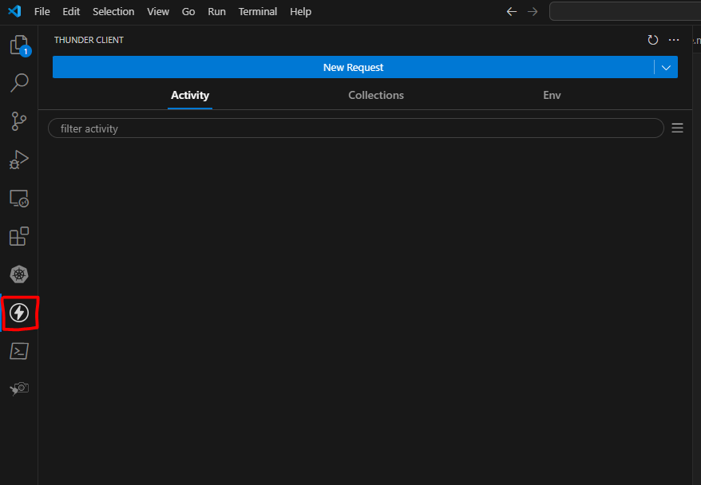
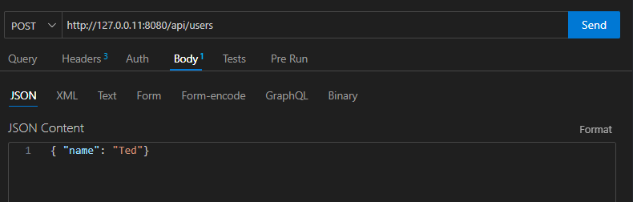

# Posting and creating users

Okay, so now we're going to want to create a user through our endpoint by providing a POST request.

In Go, the standard HTTP handler doesn't do this well, but we'll refactor that later.

## Refactor

1. In main.go rename your `getUsers` function to be `handleUsers`. Update the code in you main function to call `handleUsers` rather than `getUsers`.
2. Add the following code at the top of the handleUsers function:

```go
func handleUsers(writer http.ResponseWriter, request *http.Request) {
    // Check if the request method is GET
    if request.Method != http.MethodGet {
        http.Error(writer, "Method Not Allowed", http.StatusMethodNotAllowed)
        return
    }

    //rest of the code as before

}
```

## Test it out

Install the Thunder Client extension in VS Code. This allows us to send requests to our API that we cannot from our browser.

You can open Thunder Client by clicking on the icon on the left:



Click on the New Request button to create a new request:


Update the endpoint to be `http://127.0.0.1:8080/api/users` and the method to be POST:


Make sure your server is running, and click the Send button.

## Handling POST requests

Let's update our `handleUsers` function to deal with POST request. Replace the code we just added with:

```go
func handleUsers(writer http.ResponseWriter, request *http.Request) {

    if request.Method == http.MethodPost {
        
        return
    }

    //rest of the code as before

}
```

There are a couple of things we need to do here. We want to make sure that the JSON we have been sent is a valid user object, and then we need to insert that user into the db and return the new user id.

1. Unmarshal JSON to struct

```go
func handleUsers(writer http.ResponseWriter, request *http.Request) {

    if request.Method == http.MethodPost {
        
        var user db.User
        err := json.NewDecoder(request.Body).Decode(&user)
        if err != nil {
            fmt.Println("Error decoding request body:", err)
            http.Error(writer, "Bad Request", http.StatusBadRequest)
            return
        }

        return
    }

    //rest of the code as before

}
```

2. Insert the data into the Mock DB

Now, we want to add a new user to our "database". To do this, in our `inmemory.go` file, we add a new function, `AddUser()`:

```js
func AddUser(user User) int {

}
```

This function accepts a User struct as a parameter and will return the id of the newly created user.

> In a DB, this id would be created for us by the database itself, as we'll see later. But for now, we'll be mocking that, and to do so we will create a package-level variable called `count` to increment this number.

Add the `count` package-level variable at line 8, and set it's value to 3:

```go
var count int = 3
```

Now we can append our user that was passed to us to the slice (which mocks what would happen in a real DB), increment the count, and return the id.

```go
func AddUser(user User) (id int) {
	count++
	user.ID = count

	users = append(users,user)
	
	return count
}
```


## 3. Return the id and successful response

Now in our `main.go` file, we need to add the code to handle calling our mock database, and returning a succesful response with the id:

```go
    if request.Method == http.MethodPost {
        // code as before

        id := db.AddUser(user)
        writer.WriteHeader(http.StatusCreated)
		fmt.Fprintf(writer, "User created successfully: %d", id)

        return
    }
```

## Test it out

Okay, let's test that out. Save the file and run the code. In Thunder Client update the Body to be `{"name":"Ted"}`:



and click Send!

Now if you got back to your browser to `http://127.0.0.1:8080/api/users` you should see you have four users.

---

[>> Part 5 - Routing Requests](/Part5/multiplexing.md)