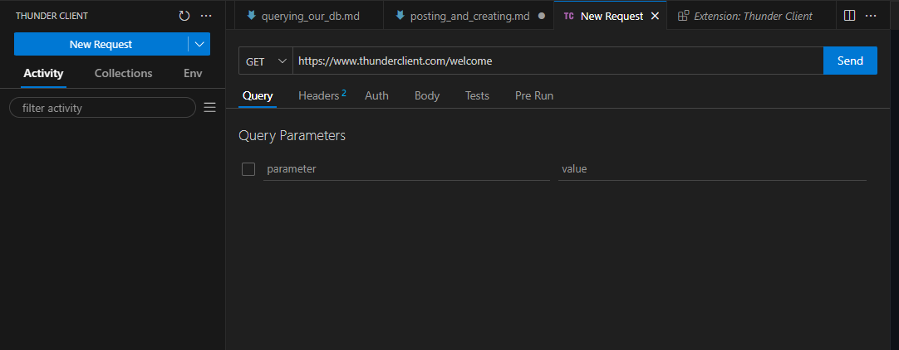

# Posting and creating users

Okay, so now we're going to want to create a user through our endpoint by providing a POST request.

In Go, the standard HTTP handler doesn't do this well, but we'll refactor that later.

## Refactor

1. In main.go rename your `getUsers` function to be `handleUsers`. Update the code in you main function to call `handleUsers` rather than `getUsers`.
2. Add the following code at the top of the handleUsers function:

```go
func handleUsers(writer http.ResponseWriter, request *http.Request) {
    // Check if the request method is GET
    if request.Method != http.MethodGet {
        http.Error(writer, "Method Not Allowed", http.StatusMethodNotAllowed)
        return
    }

    //rest of the code as before

}
```

## Test it out

Install the Thunder Client extension in VS Code. This allows us to send requests to our API that we cannot from our browser.

You can open Thunder Client by clicking on the icon on the left:


Click on the New Request button to create a new request:



Update the endpoint to be `http://127.0.0.1:8080/api/users` and the method to be POST:


Make sure your server is running, and click the Send button.

## Handling POST requests

Let's update our `handleUsers` function to deal with POST requests:

```go
func handleUsers(writer http.ResponseWriter, request *http.Request) {

    if request.Method == http.MethodPost {
        
        return
    }

    //rest of the code as before

}
```

There are a couple of things we need to do here. We want to make sure that the JSON we have been sent is a valid user object, and then we need to insert that user into the db and return the new user id.

1. Unmarshal JSON to struct

```go
func handleUsers(writer http.ResponseWriter, request *http.Request) {

    if request.Method == http.MethodPost {
        
        var user User
        err := json.NewDecoder(request.Body).Decode(&user)
        if err != nil {
            fmt.Println("Error decoding request body:", err)
            http.Error(writer, "Bad Request", http.StatusBadRequest)
            return
        }

        return
    }

    //rest of the code as before

}
```

2. Insert the data into the DB

```go
func handleUsers(writer http.ResponseWriter, request *http.Request) {

    if request.Method == http.MethodPost {
        
        var user User
        err := json.NewDecoder(request.Body).Decode(&user)
        if err != nil {
            fmt.Println("Error decoding request body:", err)
            http.Error(writer, "Bad Request", http.StatusBadRequest)
            return
        }

		// Execute the query to insert the user into the database
		var id int
		err = db.DB.QueryRow("INSERT INTO users (name) VALUES ($1) RETURNING id", user.Name).Scan(&id)
		if err != nil {
			fmt.Println("Error inserting user into the database:", err)
			http.Error(writer, "Internal Server Error", http.StatusInternalServerError)
			return
		}
	
        return
    }

    //rest of the code as before

}
```

3. Return the created user id:

```go
func handleUsers(writer http.ResponseWriter, request *http.Request) {

    if request.Method == http.MethodPost {
        
        var user User
        err := json.NewDecoder(request.Body).Decode(&user)
        if err != nil {
            fmt.Println("Error decoding request body:", err)
            http.Error(writer, "Bad Request", http.StatusBadRequest)
            return
        }

		// Execute the query to insert the user into the database
		var id int
		err = db.DB.QueryRow("INSERT INTO users (name) VALUES ($1) RETURNING id", user.Name).Scan(&id)
		if err != nil {
			fmt.Println("Error inserting user into the database:", err)
			http.Error(writer, "Internal Server Error", http.StatusInternalServerError)
			return
		}
	
		writer.WriteHeader(http.StatusCreated)
		fmt.Fprintf(writer, "User created successfully: %d", id)

        return
    }

    //rest of the code as before

}
```

## Test it out

Okay, let's test that out. Save the file and run the code. In Thunder Client update the Body to be `{"name":"Ted"}`:


and click Send!

Now if you got back to your browser to `http://127.0.0.1:8080/api/users` you should see you have two users.

---

[>> Part 6 - Routing Requests](/Part6/multiplexing.md)